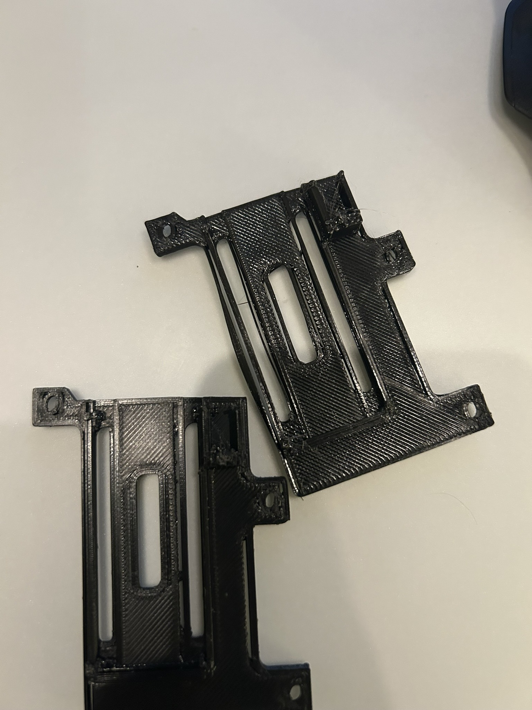
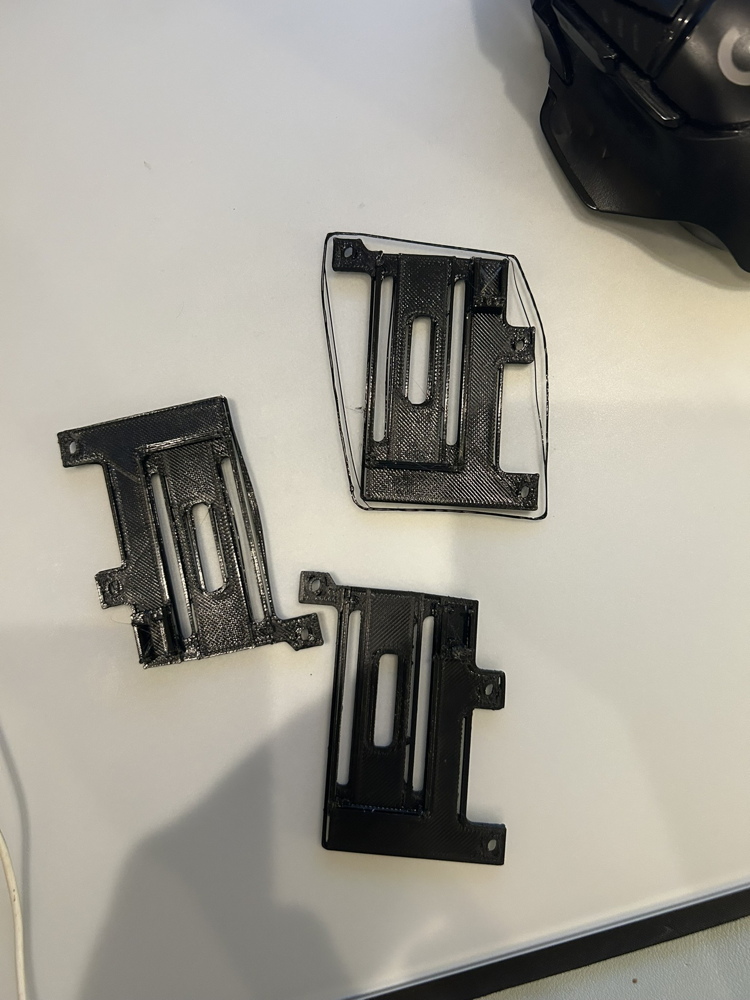
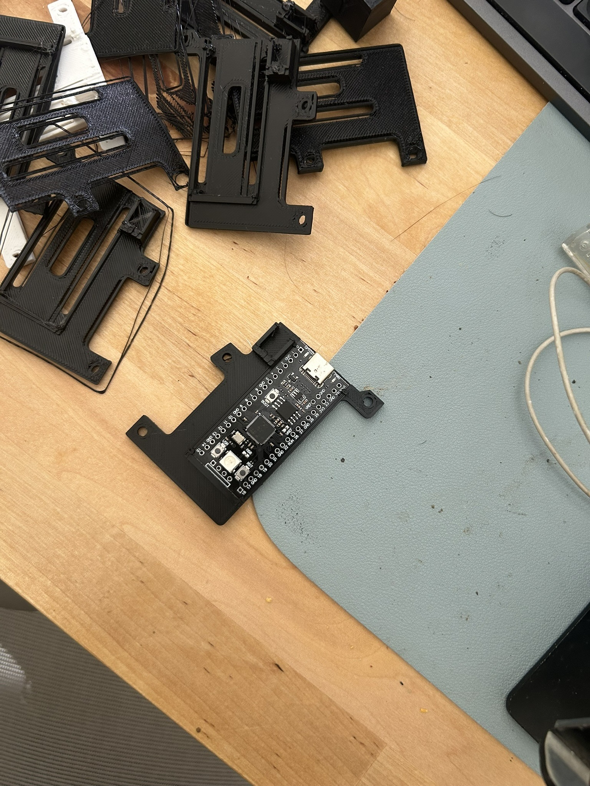
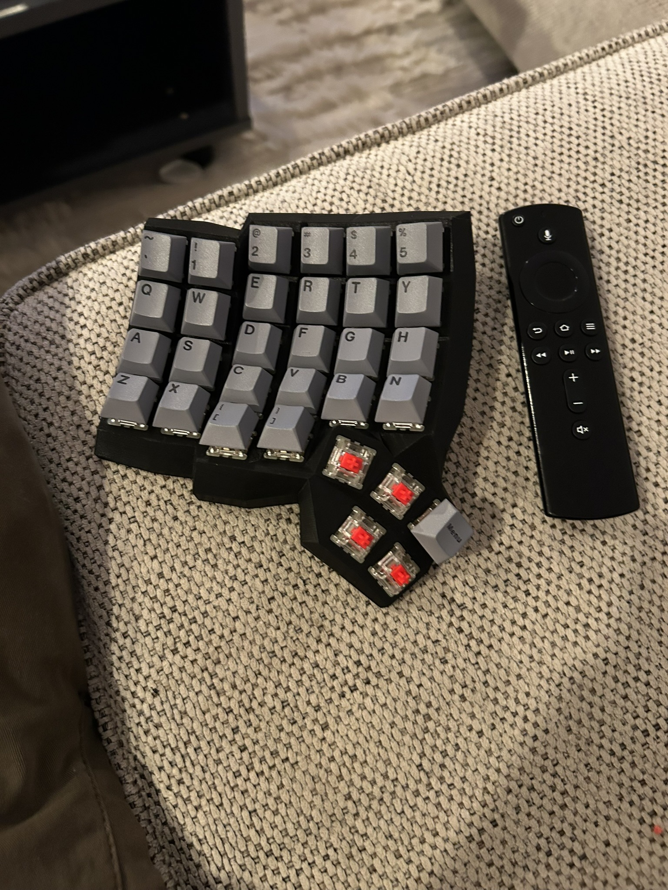
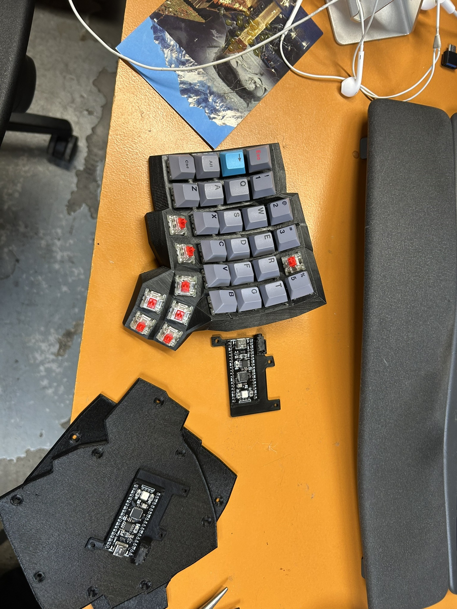
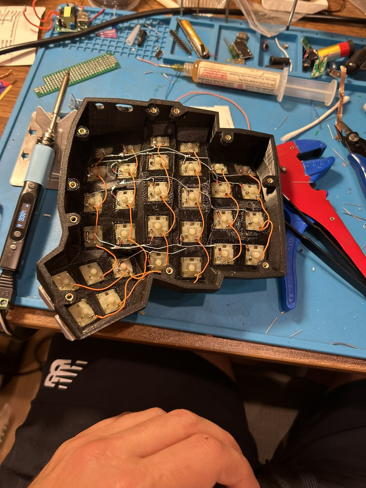

# Dactyl Manuform

My first large 3D printed project, handwired keyboard, ergo keyboard. I had some experience in 3D printing small things, soldering, firmware and python.

**Controller:** Raspberry Pi Pico (RP2040), one per half  
**Firmware:** Vial QMK (started with KMK/Pog, switched to QMK)  
**Matrix:** 62 keys, hand-wired with 1N4148 diodes  
**Connection:** Split via TRRS, serial UART  

---

## What I Already Had

- **3D printer** — Ender 3, got it from Microcenter for $100 a couple years ago and used it here and there. Recently I was learning Fusion 360 because TinkerCAD was not cutting it for anything serious.
- **Soldering irons** — Pinecil and cheap variety
- **Accessories** — wick, flux, wire, solder, alcohol, wire strippers

---

## 3D Printing

---

## Assembly

---

## Hand Wiring

---

## Firmware

Started with KMK (Python-based, via Pog), eventually moved to Vial QMK for better features and keymap GUI support.

---

## Parts

Ordered from AliExpress:

- Black Pi Pico with USB-C (x2)
- 1N4148 diodes (100 pack)
- Keycaps
- TRRS connectors + cable
- Rainbow ribbon cable
- Assorted M3 screws
- M3 heat set inserts
- Silicone rubber bumps
- Wrist rests

Case generated with [Cosmos](https://ryanis.cool/cosmos/).

---

## What I'd Do Differently

- Pick a layout generator earlier — spent too much time on manual Fusion 360 work
- Use ribbon cable from the start instead of individual wires
- Test firmware before wiring the second half
- Start with QMK instead of KMK — the tooling and community support are much better
